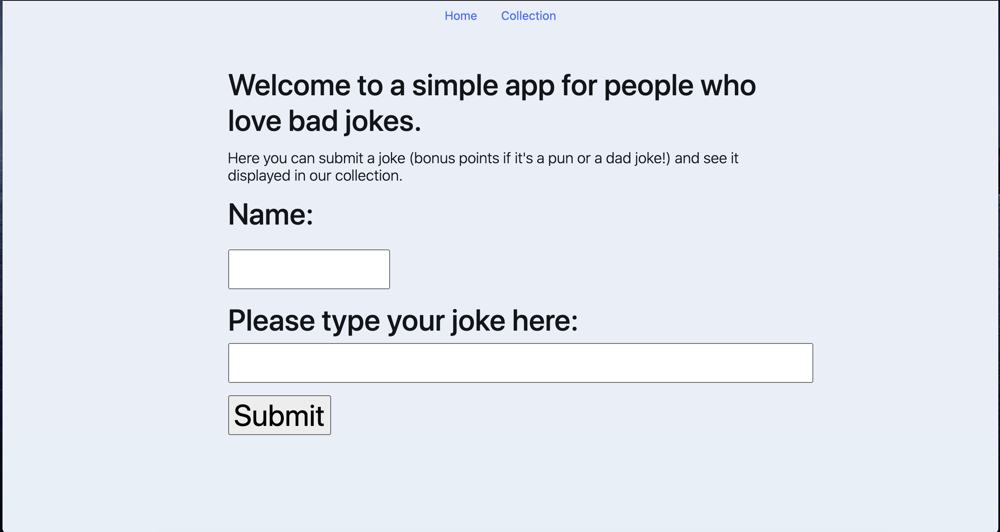
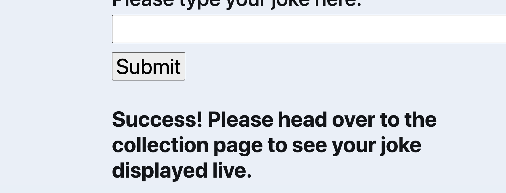
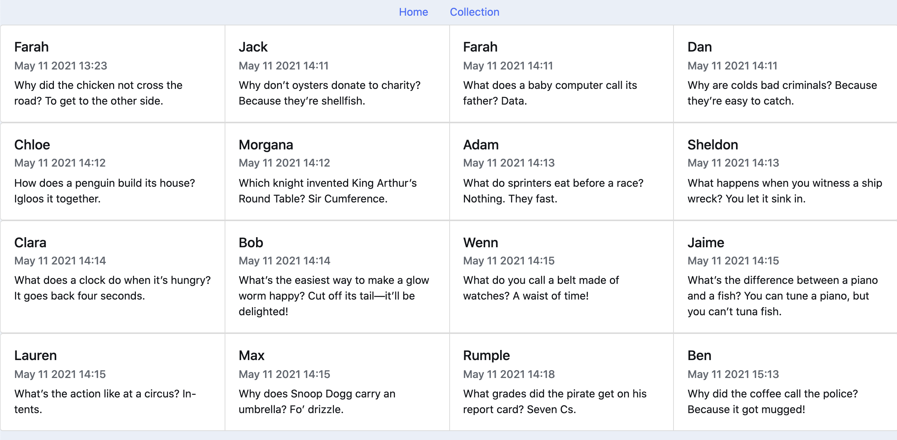

## Jokes App + Deployment on AWS 

### What does this app do? 
Simple! When you first access the page (using the ip address which will be outputted after you run `terraform apply`)
- You will be met with this page:

- Insert your name and a joke. You should see the following success message:

- You can then head over to the collection to confirm that your joke has been added to the MongoDB. 


### Pre-requisites 
**This README assumes a basic understanding of docker, terraform and bash commands. After downloading the files in this repo:**

2. To host this app on AWS, you need the following installed on your system:
    a) Terraform 
    b) a bash / linux terminal 

    When this project is complete, you should be able to host the app by carrying out the following steps: (Currently not working,i still need to provision AMIs using Ansible) 

    i. make sure all variables are filled (see Configuation and Security section) with working AWS credentials 

    ii. terraform init, build and apply 

    iii. step ii will output an ip address, which you can type into your browser to access the app. 

3. To host this app locally, you need the following installed on your system:
    a) Docker 
    b) Python 

    i. global vars for `docker-compose` file

    ii. go into the `jokes_webapp` directory in your terminal
    
    iii. command: `docker-compose up` 
    
    iv. manually exec into the mongodb container and configure the db with your username and password (i should automate this step)
    

### Networking Structure 
## Increment 
Currently both the front-end servers are hosted in a public subnet, I would like to move them to the private subnet and allow access only via a bastion in the public subnet, for increased security, as described [here](https://developer.ibm.com/articles/secure-vpc-access-with-a-bastion-host-and-terraform/): 


### Terraform Module Structure

### Configuration and Security 
- These files do not contain any of the passwords or AWS key names or locations, instead these are called from environment variables. 
- For personal use or modification, you can either hard-code your key names / locations into the `docker-compose` and `main.py` files or create your own environment variables. 

To use global variables in `docker-compose`, save your variables in a file called `.my_env` and run the following commands 

```bash
set -a
source .my_env
docker-compose up -d
```

- You would also need either hard-code or call AWC credentials for the  `terraform/variables.tf` file.
